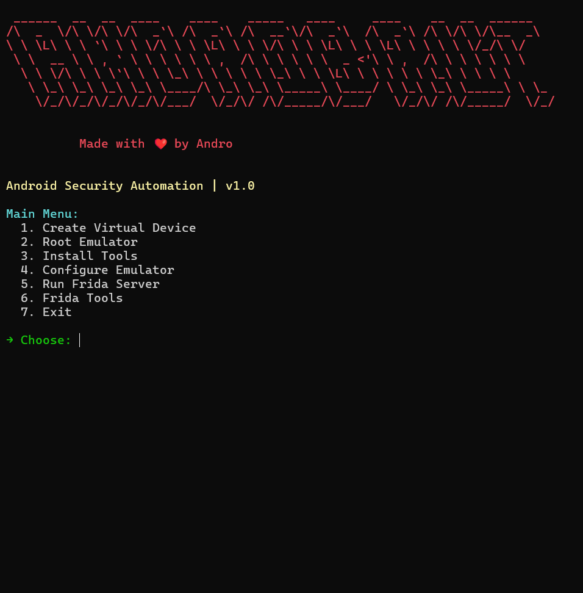
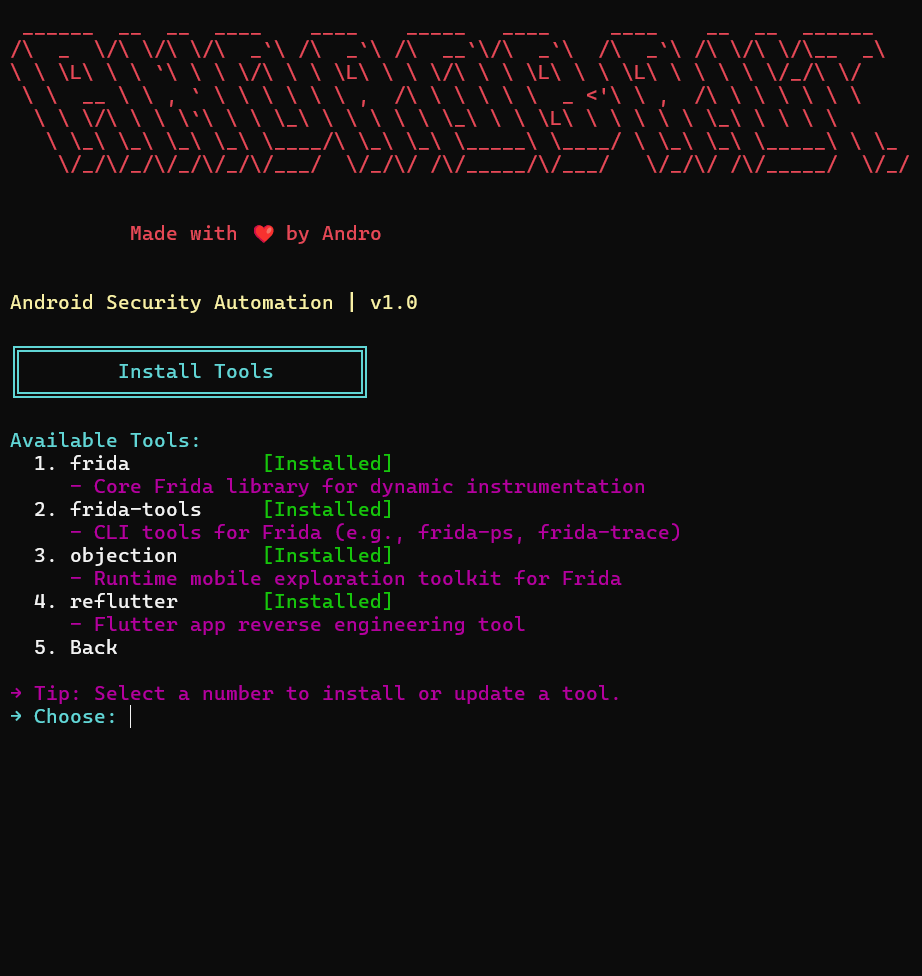

<div align="center">

<br/><br/>

<!-- Security-scan viewfinder — camera-style corner brackets + rotating radar sweep + vuln markers -->
<svg xmlns="http://www.w3.org/2000/svg" width="220" height="220" viewBox="0 0 220 220">
  <defs>
    <radialGradient id="bgGlow" cx="50%" cy="50%" r="50%">
      <stop offset="0%" stop-color="#FF3D00" stop-opacity="0.18"/>
      <stop offset="100%" stop-color="#FF3D00" stop-opacity="0"/>
    </radialGradient>
    <linearGradient id="sweepGrad" x1="0" y1="0" x2="1" y2="0">
      <stop offset="0%" stop-color="#FF3D00" stop-opacity="0"/>
      <stop offset="100%" stop-color="#FF3D00" stop-opacity="0.55"/>
    </linearGradient>
  </defs>

  <circle cx="110" cy="110" r="95" fill="url(#bgGlow)"/>

  <!-- Faint scan grid -->
  <g stroke="#4FC3F7" stroke-opacity="0.12" stroke-width="0.6">
    <line x1="55" y1="30" x2="55" y2="190"/>
    <line x1="110" y1="30" x2="110" y2="190"/>
    <line x1="165" y1="30" x2="165" y2="190"/>
    <line x1="30" y1="55" x2="190" y2="55"/>
    <line x1="30" y1="110" x2="190" y2="110"/>
    <line x1="30" y1="165" x2="190" y2="165"/>
  </g>

  <!-- Camera-style corner brackets (viewfinder frame) -->
  <g stroke="#FF3D00" stroke-width="3" fill="none" stroke-linecap="round" stroke-opacity="0.85">
    <path d="M30,55 L30,30 L55,30"/>
    <path d="M165,30 L190,30 L190,55"/>
    <path d="M190,165 L190,190 L165,190"/>
    <path d="M55,190 L30,190 L30,165"/>
  </g>

  <!-- Rotating radar sweep -->
  <g>
    <path d="M110,110 L110,25 A85,85 0 0,1 168,50 Z" fill="url(#sweepGrad)">
      <animateTransform attributeName="transform" type="rotate" from="0 110 110" to="360 110 110" dur="4s" repeatCount="indefinite"/>
    </path>
    <circle cx="110" cy="110" r="85" fill="none" stroke="#7C4DFF" stroke-width="1" stroke-opacity="0.25"/>
  </g>

  <!-- Central lock glyph (path only, no text) -->
  <rect x="98" y="105" width="24" height="20" rx="3" fill="#0a0e1c" stroke="#FF3D00" stroke-width="2"/>
  <path d="M102,105 L102,97 A8,8 0 0,1 118,97 L118,105" fill="none" stroke="#FF3D00" stroke-width="2.2"/>
  <circle cx="110" cy="114" r="2.4" fill="#FF3D00">
    <animate attributeName="opacity" values="0.4;1;0.4" dur="1.6s" repeatCount="indefinite"/>
  </circle>

  <!-- Blinking vulnerability markers -->
  <circle cx="70" cy="70" r="3.5" fill="#FF3D00">
    <animate attributeName="opacity" values="0;1;0" dur="2.4s" begin="0.2s" repeatCount="indefinite"/>
  </circle>
  <circle cx="150" cy="145" r="3" fill="#00e676">
    <animate attributeName="opacity" values="0;1;0" dur="2.1s" begin="0.9s" repeatCount="indefinite"/>
  </circle>
  <circle cx="150" cy="65" r="2.5" fill="#7C4DFF">
    <animate attributeName="opacity" values="0;1;0" dur="1.9s" begin="0.5s" repeatCount="indefinite"/>
  </circle>
  <circle cx="65" cy="150" r="3" fill="#4FC3F7">
    <animate attributeName="opacity" values="0;1;0" dur="2.6s" begin="1.3s" repeatCount="indefinite"/>
  </circle>

  <!-- Orbiting marker ring dot, reusing the proven orbit technique -->
  <circle r="3" fill="#FF3D00" opacity="0.85">
    <animateMotion dur="6s" repeatCount="indefinite">
      <mpath href="#scanOrbit"/>
    </animateMotion>
  </circle>
  <path id="scanOrbit" d="M110,25 A85,85 0 1 1 109.9,25" fill="none"/>
</svg>

<br/><br/>

     

<br/><br/>

<a href="#-key-features"></a> <a href="#-installation"></a> <a href="#%EF%B8%8F-usage"></a> <a href="#%EF%B8%8F-troubleshooting"></a>

</div>

<br/>

<div align="center">
<svg width="900" height="20" viewBox="0 0 900 20">
  <line x1="0" y1="10" x2="900" y2="10" stroke="#FF3D00" stroke-width="1" stroke-dasharray="2 6" stroke-opacity="0.5">
    <animate attributeName="stroke-dashoffset" values="0;-32" dur="2s" repeatCount="indefinite"/>
  </line>
</svg>
</div>

> [!IMPORTANT]
> **Windows only for now — Linux support is coming soon.** AndroBrut is built and tested against Windows Terminal + Android Studio.

## 🚀 Overview

**AndroBrut 1.0** is a Windows-optimized toolkit for **Android Studio**, built to streamline a mobile penetration testing lab. It automates emulator creation, rooting, Frida server setup, and Burp Suite certificate installation — so you spend time testing, not setting up. Linux support is on the roadmap.

---

## ✨ Key Features

| | Feature | What it does |
|---|---|---|
| 🖥️ | **Windows & Android Studio Optimized** | Integrates directly with Windows Terminal and Android Studio |
| 🔓 | **One-Click Rooting** | Roots emulators (API 31, x86_64/arm64) via Magisk + rootAVD |
| 🔐 | **Burp Suite Integration** | Installs a system-trusted Burp CA cert through a Magisk module |
| 🧩 | **Custom Frida Scripts** | Drop in your own scripts alongside built-in SSL pinning / root bypasses |
| 🎨 | **Vibrant CLI UI** | ASCII art, color, and an intuitive numbered menu |
| ⚡ | **Frida Powerhouse** | Run the server, list apps, and fire scripts on demand |
| 📦 | **Tool Installer** | One-click `frida-tools`, `objection`, `reflutter`, and more |
| 🐧 | **Linux Support** | Coming in a future update |

---

## 🚀 Getting Started

**Prerequisites**
- Windows (Linux support coming soon)
- Python 3.9+ — not the Microsoft Store build
- Android Studio + Android SDK Platform-Tools
- `frida-tools` (`pip install frida-tools`)
- `curl` (bundled with Git Bash, or [download here](https://curl.se/windows/))
- Virtualization enabled (VT-x/AMD-V) for emulators
- Internet access for downloading Magisk, rootAVD, and Frida server

---

## ⚡ Installation

```bash
git clone https://github.com/ChiranjibSaiChandanNath/AndroBrut.git
cd AndroBrut
pip install -r requirements.txt
python AndroBrut.py
```

---

## 🛠️ Usage

<details>
<summary><b>Automating Rooting</b></summary>
<br/>

Select **Root Emulator** to download and install Magisk, patch the system image with rootAVD, and finalize root setup. Follow the prompts to cold boot the emulator and complete Magisk configuration.
</details>

<details>
<summary><b>Installing the Burp Certificate</b></summary>
<br/>

Select **Configure Emulator → Install Burp Suite Certificate**. Make sure Burp Suite is running on `127.0.0.1:8080` and the emulator proxy is set. AndroBrut handles certificate download, conversion, and installation as a system-trusted CA via the `AlwaysTrustUserCerts` Magisk module.
</details>

<details>
<summary><b>Adding Custom Frida Scripts</b></summary>
<br/>

Go to **Frida Tools → Add Custom Script**, paste your script, name it (e.g. `MyScript.js`), and it's saved to the `Fripts` directory. Custom scripts show up in the Frida Tools menu (options 6+) and persist across sessions. `SSL-BYE.js`, `ROOTER.js`, and `PintooR.js` are reserved defaults.
</details>

<details>
<summary><b>Running Frida Server</b></summary>
<br/>

Select **Run Frida Server** to start it in the background on the emulator. Requires a rooted emulator with Frida server already installed via **Configure Emulator → Install Frida Server**.
</details>

---

## 📸 Screenshots

<p align="center">
  
  <br><sub><em>Main Menu — vibrant UI, clear menu options</em></sub>
</p>
<p align="center">
  
  <br><sub><em>Frida Tools — menu with custom script support</em></sub>
</p>

---

## 🛡️ Troubleshooting

<details>
<summary><b>Emulator not detected</b></summary>
<br/>
Run <code>adb devices</code> to verify the connection. Confirm the Android Studio emulator is running (API 31, x86_64/arm64).
</details>

<details>
<summary><b>Rooting fails</b></summary>
<br/>
Verify <code>ANDROID_HOME</code> is set and the system image path is correct. Check <code>rootAVD_list.txt</code> for details.
</details>

<details>
<summary><b>Certificate issues</b></summary>
<br/>
Confirm Burp Suite is bound to <code>127.0.0.1:8080</code> and the emulator proxy is set. Reboot after installing <code>AlwaysTrustUserCerts</code>.
</details>

<details>
<summary><b>Frida script errors</b></summary>
<br/>
Confirm scripts are in <code>Fripts</code> and the Frida server is running. Use <code>frida-ps -U</code> to verify.
</details>

---

## 🙏 Credits

- [Frida](https://github.com/frida/frida) — dynamic instrumentation
- [Magisk by topjohnwu](https://github.com/topjohnwu/Magisk) — rooting
- [rootAVD by NewBit](https://gitlab.com/newbit/rootAVD) — emulator patching
- [AlwaysTrustUserCerts by NVISOsecurity](https://github.com/NVISOsecurity/AlwaysTrustUserCerts) — certificate trust

---

## 💌 Contact

- [GitHub Issues](https://github.com/ChiranjibSaiChandanNath/AndroBrut/issues)

---

## 📜 License

🔐 **AndroBrut is licensed under the MIT License (LICENSE).**

<br/>

<p align="center"><em>No root, no glory.</em></p>
